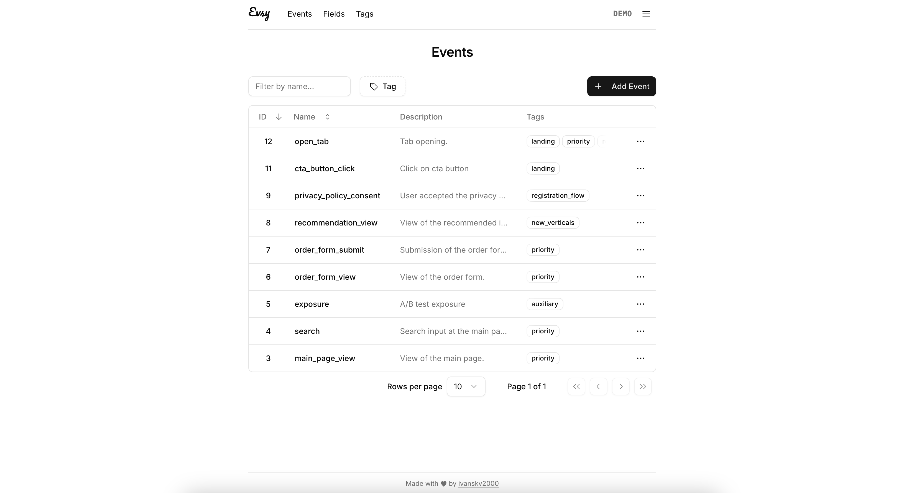

# Evsy
Evsy is a lightweight admin panel for managing and documenting product analytics events and their properties.



Check out the live demo at [demo.evsy.dev](demo.evsy.dev)
- Login: `demo@evsy.dev`
- Password: `bestructured`

## ✨ About
Evsy is an open-source application that helps product teams, analysts, and developers structure, document, and maintain a single source of truth for product analytics events and fields.

## 📚 Features
- Create and document events and fields.
- Organize by type, tag, or team.
- Export events as Swagger-compatible schemas.
- Sign in with email/password or OAuth2 (GitHub & Google).


**Future roadmap includes:**
- Role-based access control (RBAC);
- History of changes and event versioning;
- Full-text search;
- Draft and archived states for events;
- Markdown-based descriptions;
- ... and more!

## 🚀 Quick Start
To run Evsy via Docker compose, just do:
1. `cp .env.example .env`
2. `make up`

> Make sure to review .env.example — it contains helpful comments for configuring your setup.

## ⚙️ Tech Stack
- Backend: FastAPI + Pydantic + SQLAlchemy + Alembic
- Frontend: Vue 3 + Vite
- Component library: [shadcn-vue](https://www.shadcn-vue.com/)

## 🧩 Project Structure
Evsy is a project combining a Python FastAPI backend and a Vue3 frontend, developed and versioned together.

```
evsy/
├── backend/              # FastAPI backend (Poetry-managed)
│   ├── app/              # Application code
│   └── tests/            # Pytest
├── frontend/             # Vue 3 + Vite frontend (npm-managed)
│   ├── src/              # Application code
│   └── public/           # Static assets
├── .github/workflows/    # CI workflows
├── VERSION               # Current version of the project
├── bump_version.py       # Version bumping script (manual semantic versioning)
├── Makefile              # Developer commands (e.g. `make up`)
├── docker-compose.yaml   # Docker compose configuration
├── Makefile              # Developer commands (e.g. `make up`)
└── README.md             # Project overview
```

## 🤝 Contributing
We welcome all kinds of contributions — code, ideas, design suggestions, and bug reports.
[Read the contributing guide →](CONTRIBUTING.md)

## Build Status
[](https://github.com/ivanskv2000/evsy/actions/workflows/backend.yml)
[](https://github.com/ivanskv2000/evsy/actions/workflows/frontend.yml)


